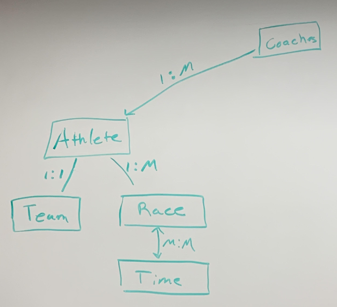
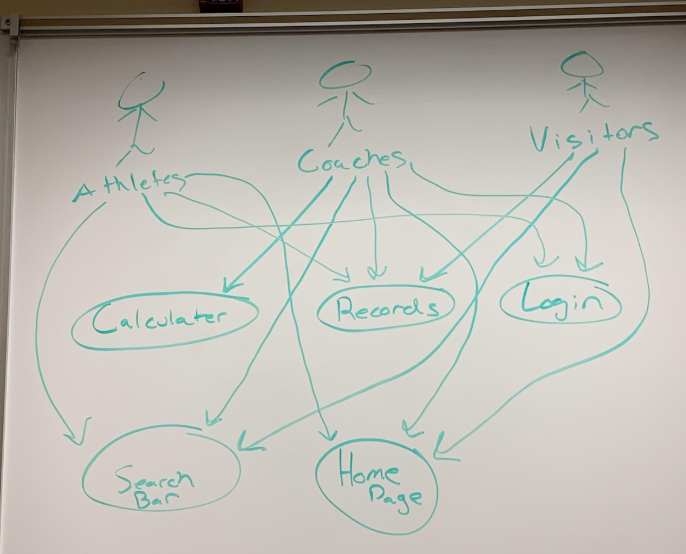
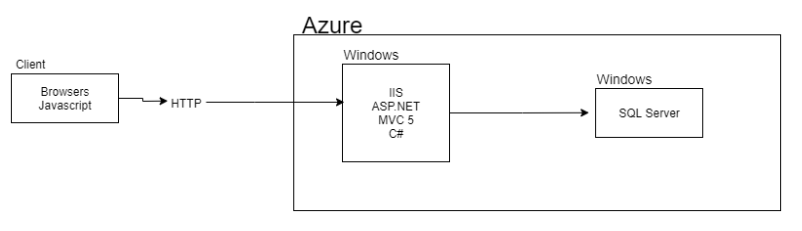
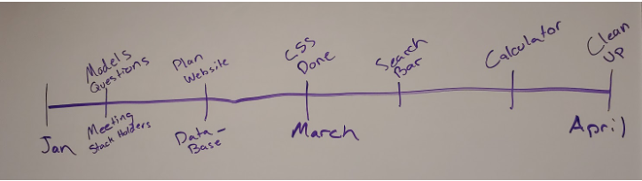

### Summary of Our Approach to Software Development:
The process we are following is the Disciplined Agile Delivery(DAD) approach. This approach allows us to work efficiently and smoothly, delivering product to the client in a proficient manner. We are choosing to keep this as simple as possible, while developing clean cut and efficient code. 

### Initial Vision Discussion with Stakeholders:
The initial vision discussion gave us quite a bit of information. Our client wants a tool for recording, storing, viewing, and tracking of race results for swim teams. On top of this, our client would like a tool to provide analysis for athlete’s current and future performances, as well as a tool that will optimize a coach’s strategy for winning a specific meet. This concept is accomplishable within our skillset, and we will stick to DAD style programming approaches to remain organized and efficient. 

### Initial Requirements Elaboration and Elicitation:
The major requirements given to us by the client are listed as follows:
1. Record, store and provide tracking, viewing and simple stats for race results for swimming athletes.  This would have a number of features found in [Athletic.net](https://www.athletic.net/), which is used for Track and Cross Country running.
2. Provide complex analysis of athlete performance over time and over different race types, to give coaches deep insight into their athlete's fitness and performance that they cannot get from their own analyses.  This includes machine learning to predict future performance based on records of past race performance, given different training scenarios.  Validation of this feature will enable the next feature.
3. Create a tool that will optimize a coach’s strategy for winning a specific meet.  This feature will automatically assign athletes to specific races based on their predicted race times in order to beat an opponent coach's strategy.  There will be two modes: one in which we have no knowledge of the opponent team's performance, and one where we do have their performance and can predict their times.

### Questions
What color would they like us to use on the pages?
Do they want to be able to add teams and Athletes or delete them?
What admin privileges do coaches have?
Is there an admin?
Is there an excel sheet or already recorded times for athletes?

### Interviews
What color would they like us to use on the pages?
        Salmon, Blue, Grey
Do they want to be able to add teams and Athletes or delete them?
        Yes
What admin privileges do coaches have?
        Add data to the website and use calculator for future times
Is there an admin?
        Yes
Is there an excel sheet or already recorded times for athletes?
        Yes, it will be needed to be added

        
### Other Elicitation Activities?
Refined Vision Statement:
We are going to make a web application that holds and displays athletes race times. Coaches will be able to have privileges to upload and pull together sheets for what athletes are in what races. We will also develop multiple tools for coaches to use, such as a tool to optimize a coach’s strategy for winning a specific meet and a tool to provide complex analysis of athlete performance over time and over different race types. This will take a couple of months to accomplish. This will cost nothing since as students we are doing this for the experience. We are going to build this in ASP.NET using MVC 5 model. We understand that we are only getting experience and might suffer some long nights but as a team we will persevere. We will use DAD style software development approaches, and utilize our communication skills to be as efficient and timely as possible. 

### List of Needs and Features
1. They want a nice looking site, with a clean light modern style, images that evoke swimming and competition.  (More like [Strava](https://www.strava.com/features) and less like [Athletic.net](https://www.athletic.net/TrackAndField/Division/Event.aspx?DivID=100004&Event=14))  It should be easy to find the features available for free and then have an obvious link to register for an account or log in.  It should be fast and easily navigable.  
2. The general public will be able to view all results (just the race distance, type and time).  These are public events and the results should be freely available.  They should be able to search by athlete name, team, coach or possibly event date and location.  Not sure if they want to be able to filter or drill down as Athletic.net does.  They're not trying to organize by state, school, etc. Athletes are athletes and it doesn't matter where they're competing.  This is completely general, but only for swimming.
3. Logins will be required for viewing statistics and all other advanced features.  We eventually plan to offer paid plans for accessing these advanced features.  They'll be free initially and we'll transition to paid plans once we get people hooked.
4. Admin logins are needed for entering new data.  Only employees and contractors will be allowed to enter, edit or delete data.
5. "Standard" logins are fine.  Use email (must be unique) for username and then require an 8+ character password.  Will eventually need to confirm email to try to prevent some forms of misuse.  Admins and contractors must have an offline confirmation by our employees and then the "super" admin adds them manually.
6. The core entity is the athlete.  They are essentially free agents in the system.  They can be a member of one or more teams at one time, then change at any time.  Later when we want to have teams and do predictive analysis we'll let the coaches assemble their own teams and add/remove athletes from their rosters.
7. The first stats we want are: 1) display PR's prominently in each race event, 2) show a historical picture/plot of performance, per race type and distance, 3) some measure of how they rank compared to other athletes, both current and historical, 4) something that shows how often they compete in each race event, i.e. which events are they competing in most frequently, and alternately, which events are they "avoiding"
        8. Results are nicely organized and easy to read or navigate. Like 100 meter dash and 200 meter dash
        9. Search Bar to search for athletes
        10. Profile for each athlete

### Initial Modeling
  

### Use Case Diagrams
  

### Identify Non-Functional Requirements

1. User accounts and data must be stored indefinitely.  They don't want to delete; rather, mark items as "deleted" but don't actually delete them.  They also used the word "inactive" as a synonym for deleted.
2. Passwords should not expire
3. Site should never return debug error pages.  Web server should have a custom 404 page that is cute or funny and has a link to the main index page.
4. All server errors must be logged so we can investigate what is going on in a page accessible only to Admins.
5. English will be the default language.
6. Database to store athletes data
7. Authentication for signs ups
8. Calculator for future times
9. System for uploads of data of different file times
10. Search Bar autofill

### Identify Functional Requirements (User Stories)

E: Epic  
U: User Story  
T: Task  

1. [E] As an administrator I want to be able to upload a spreadsheet of results so that new data can be added to our system

2. [U]- As an administrator, I want to have special access and privileges

3.[U]- As someone with upload privileges, I would like to be able to upload spreadsheet of data

4. [U] As a visitor to the site, I want to be able to search for any athlete or location and retrieve information from the site. 

5. [U] As an admin (or coach) I would like a calculator to predict information about races and athletic events 

6.[U] As a visitor to the site I would like to see a fantastic and modern homepage that introduces me to the site and the features currently available.
    [T] Create starter ASP dot NET MVC 5 Web Application with Individual User Accounts and no unit test project
   [T] Choose CSS library (Bootstrap 3, 4, or ?) and use it for all pages
   [T] Create nice homepage: write initial content, customize navbar, hide links to login/register
   [T] Create SQL Server database on Azure and configure web app to use it. Hide credentials.

7.  [U] As a visitor to the site I would like to be able to register an account so I will be able to access athlete statistics
   [T] Copy SQL schema from an existing ASP.NET Identity database and integrate it into our UP script
   [T] Configure web app to use our db with Identity tables in it
   [T] Create a user table and customize user pages to display additional data
   [T] Re-enable login/register links
   [T] Manually test register and login; user should easily be able to see that they are logged in

8. [U] As a visitor I want to be able to search for an athlete and then view their athlete page so I can find out more information about them

9. [U] As a visitor I want to be able to view race results for an athlete so I can see how they have performed

10. [U] As a visitor I want to be able to view PR's (personal records) for an athlete so I can see their best performances

11. [U] As a robot I would like to be prevented from creating an account on your website so I don't ask millions of my friends to join your website and try to add comments about male enhancement drugs.

### Initial Architecture Envisioning
  

### Agile Data Modeling
  

## Timeline and Release Plan

