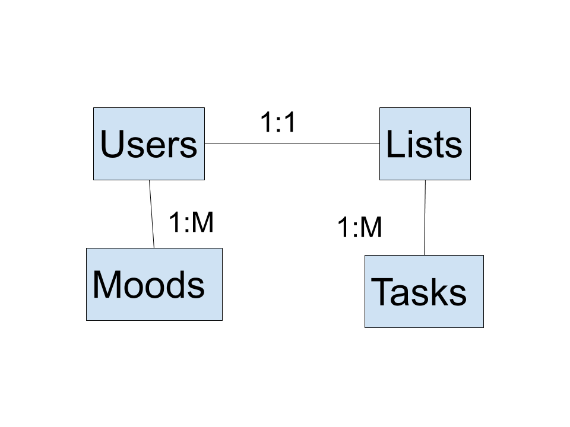
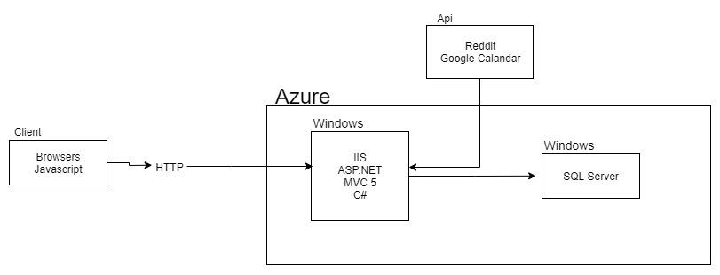

### Other Elicitation Activities
Refined Vision Statement:
**For**  those of us **who**  can be overwhelmed by the day-to-day, **the**  HelpAlong web app is an all encompassing coping tool **that**  provides a single point of access to various coping strategies. The website will offer a variety of services that help users find a therapist in their area, figure out which methods of self-care work best for them, keeps their daily lives organized and on track, and provides a coping space filled with positive activities. **Unlike**  other mental health management applications, **our product**  will provide a cohesive experience for the user to explore what self care and mental well-being means to them. 

### Summary of Our Approach to Software Development:
The process we are following is the Disciplined Agile Delivery(DAD) approach. This approach allows us to work efficiently and smoothly, delivering product to the client in a proficient manner. We are choosing to keep this as simple as possible, while developing clean cut and efficient code. 

### Initial Vision Discussion with Stakeholders:
The initial vision discussion gave us quite a bit of information. Our client likes our ideas and wants us to do further research with psychology professionals. This concept is accomplishable within our skillset, and we will stick to DAD style programming approaches to remain organized and efficient. 

### Initial Requirements Elaboration and Elicitation:
The major requirements given to us by the client are listed as follows:
1. Our project will have information and resources for people who sign up. This will entail having a quiz to figure out what features you may like. We will also have a page with resources like therapist and emergency services.
2. There will be a calendar and list to hold information about what you need to do and what you should be doing. List will hold events from your calendar and can hold levels of importance to tasks. There will be a calendar reminder about things that need to be done.
3. Coping space will be added where users can let go and relax. Things like meditation gifs and a writing space to put down your feelings will be needed. Other spaces might be added to help the user express their feelings and come back to a peaceful state of mind. 

### Questions
Will users be able to register?
        Yes
Will there be different kinds of feature for people with different problems?
        Yes
Does this cost anything for the user?
No 

Will there be ads on the site?
          No

### Interviews
Will I be able to propose suggestions for the developers?
        Yes. In the about page there will be an email for users to submit questions and concerns

What mental health problems are you helping?
        We aren’t helping any one specific but are making features to help people in general no matter what there problems are.

Is this a diagnostic tool?
        We are not licensed therapists so we always recommend consulting a doctor, especially in the event of a medical emergency. HelpAlong is not meant to be used to diagnose users and we leave that up to the professionals. 
       

### List of Needs and Features
1. I would like the list to have my events from my calendar so I can see what I need to do. As well as add things to my calendar. I should get reminded about these things and be able to check them off.
2. The list should have a level todo lists where users will be able to select what kind of level of activity they want to do. Being able to check this off and getting a nice notification to let the user know they did a good job when they are done.
3.  A space to write about my feelings and emotions in a non-documented manar. Where afterwards I can click submit and it will all go away. I can choose how I want to make the text go away.
4. A breathing / meditation space where I can see a gif to help me focus my breathing and listening to music. I can choose between some music and having no music as well as the gif and space color. 
5. I want to be able to see resources and ememercy information so that I can get help when needed or search for help. A page with this information will make it easy for users to find what they need
6. When I registered I want to be able to take a quiz where it will tell me what I may want to take a look at and use. The quiz will not be long and be easy to do. This will only appear when first registering
7. I want to be reminded about when to take my medication. I will get a good calendar reminder about it and can make it as done if I have taken it. I will get another reminder if I haven’t taken it by a certain time.

### Initial Modeling
  

### Use Case Diagrams
  

### Identify Non-Functional Requirements
      1.) Passwords should not expire
      2.) Custom 404 page that is cute and funny
      3.) Database will store users login and password
      4.) Site in general will be nice and pleasing to the eye
      5.) Consistent styling throughout all page
      6.) Webpage should work on all platforms / devices
      7.) New users are added to an existing database
8. Page will be up 99% of the time and if not users will be notified

### Identify Functional Requirements (User Stories)

E: Epic  
U: User Story  
T: Task

1. [E] As a user, I want to be able to make a list of daily tasks and be reminded of them so I can stay on top of my day. 
   1. [U] As a user, I want to be able to add my Google account information to the website so that I can access my personal information.
      1. Assumptions/Preconditions: The website should be hooked up to google calendar already
         1. Description: The stakeholders want a streamlined experience for the user to enter reminders and dates. Since google calendars are fairly common amongst the general public, it makes sense to link up the tracker with a common application amongst users. Adding a task in the web app automatically adds it to a user’s google calendar and sets a reminder based off the time entered in the website for the task. This will be part of the toolbar under something called “manage tasks”. Users will be able to categorize tasks based on their own preferences (i.e “homework”, “chores”, “hobby”, “work”, etc) and assign a priority number to it.
            
            1. Tasks:
               1. Create button on taskbar for “calendar”
               2. Have a calendar pop-up upon clicking the button
               3. Trigger a JSON function upon clicking the calendar square
               4. Having the user set the type, priority and details of a calendar 
               5. Grab hold of Google Calendar api

   2. [U] As a user I want to be notified by google calendar to get the things on my list done so that I can accomplish my goals for the day. 
      2. Assumptions/Preconditions: There should be a way to send someone a notification from the web application
         2. Description: In our application users can get different types of notifications. One will be a reminder to take their medicine. If the user hasn’t checked off the reminder they will get another reminder to make sure that they take it. Some other notifications they will get is for their list of items. They will get notifications about what is on their list. The list will have things the user wants to get done. This will help keep the user focused on what they need to do.  They can choose the time and date like a normal google calendar event. They can also choose when to be notified.
            
         1. Tasks:
               1. Set up the Google Calendar API. Make sure you have keys
               2. Make a space where a list can be made and where you can add to a list
               3. Set up google Calendar API so that you create events when you add to list
               4. Set up reminders for the events so that the user gets notified.

   3. [U] As a user, I want to see a nice interface for my daily list to do that it is clear and easy to use. 
      1. Assumptions/Preconditions: There is a database in place that tracks tasks and assigns them in order of priority assigned which is chosen by the user
         1. Description: A user will have no problem adding and editing their daily task list with a clean and simple user interface. This will allow them to visualize and keep track of their tasks and goals better, and ultimately improve their daily life. Also, having a clean/nice interface will encourage users to continue to use their lists and encourage them to be excited about checking things off and staying organized. The database portion of the list is crucial, because this will not only keep track of the list but also keep track of the priorities and the order of them (the user will order these tasks themselves). As tasks are checked off, they should be removed from the database to keep it clean and take up less space. However, daily tasks that are static everyday (brush your teeth, take a shower, etc.) should remain in the database even if it is checked off. This will contribute to the easy-to-use interface because this way the user will not have to continually add the same tasks each day, and only have to add extra tasks alongside their daily to-do’s.
            
            1. Tasks:
               1. Initialize a database for this specific feature
               2. Add a way to prioritize tasks in the database
               3. Create checkboxes for tasks that specify whether this is a recurring task or a task only specific to that same day 
               4. Create UI wireframes to visualize the layout of the feature itself 
               5. Create a modern, simple UI for this feature using HTML and CSS
               6. Add scripts to connect to checkboxes that drop specific tasks once they are clicked on at the end of the day (11:59pm). Dependent on whether this is a recurring task or not. 

1. [E] As a user, I want a safe space to be able to write down my feelings or meditate.  
   1. [U] As a user, I want to choose  gif on the page to do meditation breathing too
   2. [U] As a user, I want a place to write in that will go away
      1. [T] Choose how my writing will go away when I hit submit
2. [E] As a visitor, I want a nice welcome page that will tell me about the website and have login and register links.
   1. [U] As a visitor, I want a clean webpage that lets me know what I’d be getting if I created an account with HelpAlong
   2. [U] As a visitor, I want to know that if I were to join HelpAlong, that my account was secure
      1. [T] Captcha log in check
      2. [T] https//:...
3. [E] As a user, I want to be able to be reminded to take my medication so that I can take it on time. 
   1. [U] As a user, I want to be able to add my Google account information to the website so that I can access my personal information.
   2. [U] As a user, I want to be able to add the times I need to take my medication so that I am reminded to take it on time.
   3. [U] As a user, I want to be notified by text to take my medication so that I can access my reminders from anywhere. 
   4. [U] As a user, I want it to be clear how I would go about adding the times to take my medication so that I can add them correctly therefore be notified on time. 
4. [E] As a user, I want to be able to make a list of daily tasks and be reminded of them so I can stay on top of my day. 
   1. [U] As a user, I want to be able to add my Google account information to the website so that I can access my personal information.
   2. [U] As a user I want to be notified by text to get the things on my list done so that I can accomplish my goals for the day. 
   3. [U] As a user, I want to see a nice interface for my daily list to that it is clear and easy to use. 
5. [E] As a user, I want to be able to have access to uplifting images and positive exercises to help boost my mood
   1. [U] As a user, I want to see images from r/eyebleach
      1. [T] Using Reddit Api
6. [E] As a user, I want to add my location and find therapists and mental health resources near me.
7. [E] As a user, I want to have access to information that is immediately beneficial to my needs.
   1. [U] As a user, I want to be able to take a quiz that helps match me to the most helpful resources for my immediate needs.
8. [E] As a user, I want to be able to take a short quiz to advise me on ways that would help me learn to take care of myself. 

### Initial Architecture Envisioning
  

### Agile Data Modeling
 

## Timeline and Release Plan
